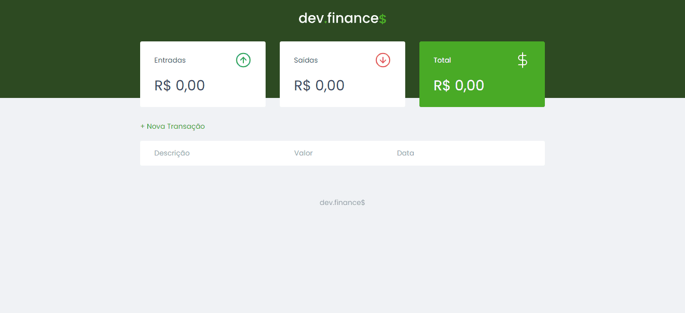
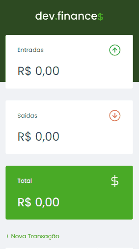

<h1 align="center">
    
</h1> 

>## 🖥️ Versão Desktop

>## 📱 Versão Mobile

>## 🚀 Tecnologias

Esse projeto foi desenvolvido com as seguintes tecnologias:

* [HTML](https://developer.mozilla.org/pt-BR/docs/Web/HTML)
* [CSS](https://developer.mozilla.org/pt-BR/docs/Web/CSS)
* [JavaScript](https://developer.mozilla.org/pt-BR/docs/Web/JavaScript)

>## 💻 Projeto
O dev.finances é uma aplicação de controle financeiro, onde é possível cadastrar e excluir transações e ver o saldo de entrada e saída.

>## 📝 Licença
Esse projeto está sob a licença MIT. Veja o arquivo [LICENSE](LICENSE.md) para mais detalhes.

---

 by Wend Carlos 👋
